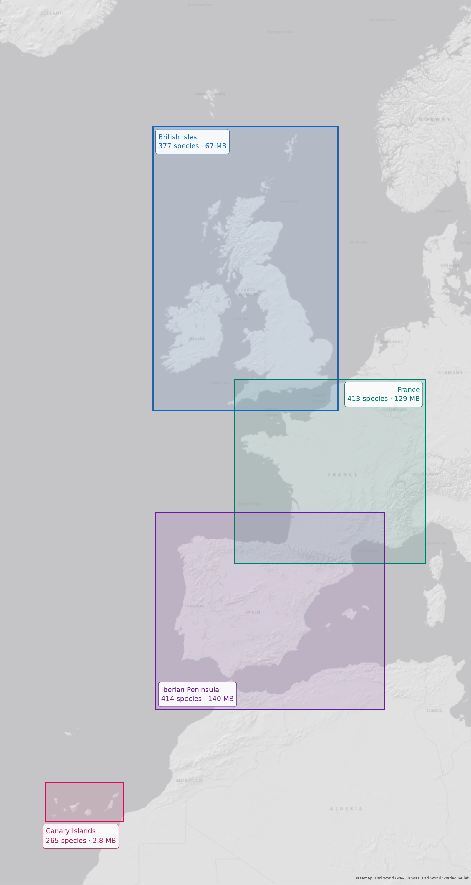

# Backyard Chirps region packs

The region packs a [Backyard Chirps](https://github.com/tapia/backyardchirps) station downloads,
and the code that builds them.

A pack is a **box, not a country**. It holds the data that only makes sense for one part of the
world: eBird Status & Trends occurrence rasters cropped to the box, a range map per species
framed on it, and the xeno-canto recordings a species page offers for comparison. Everything else
a station needs ships with the station.

A pack carries **no species list**. A list is only right for the point it was made for, and a
box-wide one would make the rare-species rule meaningless, so every station derives its own from
its own coordinates.

## The packs



Every pack in [`index.json`](index.json), which is what a station resolves its coordinates
against. Redrawn with every pack build; see [Building a pack](#building-a-pack).

| Pack | id | box (W S E N) | species | size |
|---|---|---|---:|---:|
| British Isles | `british-isles` | `-11.0 49.8 2.1 61.1` | 475 | 81 MB |
| Canary Islands | `canary-islands` | `-18.6 27.4 -13.1 29.8` | 316 | 3.2 MB |
| France | `france` | `-5.2 42.3 8.3 51.2` | 521 | 172 MB |
| Iberian Peninsula | `iberian-peninsula` | `-10.8 34.2 5.4 44.9` | 524 | 177 MB |

The map redraws itself and this table does not: it is copied from `index.json` by hand, so
update it in the same commit.

## Why this is not in the station repository

Two reasons, and the first is the one that matters:

- **Dependencies.** Drawing a range map needs contextily, geopandas and shapely. A station would
  install that stack on a Raspberry Pi and never open it. Nothing in a pack is built on a Pi.
- **Lifecycles.** The station is tagged in semver. A pack is dated, and gets rebuilt when eBird
  publishes a new data year. Hanging a large pack off a station release makes it look like part
  of the station and forces a station tag whenever a pack changes.

This repository depends on `backyardchirps`, pinned to a release, and imports it. That direction
is deliberate: the call deciding which species are plausible somewhere,
`plausible_species_names_over`, is **shared rather than copied**. A second implementation here
would drift from the stations it serves, and the drift would be silent: one species, on one
station, with no seasonality chart.

The pin is a tag rather than a branch, so a pack is built against a station that exists rather
than against whatever `main` was that morning. Raise it deliberately when this repository needs
something newer.

## Building a pack

```bash
make sync
make models                            # GeoModel, into work/

export EBIRD_API_KEY=<your-key>
export XENO_CANTO_API_KEY=<your-key>
make iberian-peninsula
make publish ID=iberian-peninsula      # then commit index.json, docs/coverage-map.webp and README.md
```

### The two keys

Both are needed **here and nowhere else**. A station holds neither, which is the point: whoever
sets up a Pi in their garden should not have to open accounts with two services first.

| Key | Where to get it | What it fetches |
|---|---|---|
| `EBIRD_API_KEY` | [eBird Status & Trends](https://science.ebird.org/en/status-and-trends/download-data) access request | The occurrence rasters and the range polygons |
| `XENO_CANTO_API_KEY` | Your [xeno-canto account page](https://xeno-canto.org/account) | The reference recordings a species page offers |

The xeno-canto key is worth understanding, because it is the reason reference recordings are in a
pack at all. **Searching** xeno-canto needs a key; **playing** a recording does not, since the
files sit at ordinary addresses. So the search runs once, here, and a pack carries the addresses
it found. A station plays them straight from xeno-canto and never talks to their API.

Both keys are checked before the long work starts, so a missing one fails in seconds rather than
after an hour of downloading. `--skip-reference-calls` builds without the xeno-canto key, and
`make preview` passes it for you.

Go through the Makefile rather than calling the tool directly. One version string has to reach
three places that agree: the pack file name, the release tag, and the download URL written into
`index.json`. Out of step, the index sends every station to a 404 and the only fix is a new
index. The Makefile derives all three from one value and refuses to publish when they disagree.

`make help` lists the packs already defined. A new one is four lines in the Makefile, on purpose:
a bounding box goes into `pack.json` and `index.json`, where a mistyped one is expensive to take
back.

**Check a box before building anything from it:**

```bash
make box-image ID=somewhere BBOX="W S E N"    # writes dist/boxes/somewhere.png
```

That draws the box on the same basemap a range map is framed on, dimming everything outside it,
and takes seconds without an eBird key. It is the only check there is: no test can tell you that
a box misses an island, because the question is geographic rather than arithmetic. An island in
the dimmed margin looks covered and is not.

**The map at the top of this file** is drawn from `index.json` alone, so it shows what stations
can actually be offered and nothing that is only planned. Building a pack redraws it right after
the index is updated, and `make coverage-map` redraws it on its own, which takes seconds and no
key. Commit it with `index.json`, along with the row the pack gets in the table under it.

Then `make preview ID=... BBOX="W S E N"` builds a real pack from the box with no maps and no
index entry, which is the cheap way to see how many species it pulls in before committing hours
to it.

Underneath, the builder asks GeoModel which species are plausible over a grid of points covering
the box, downloads the eBird data for each of them, crops every raster to the box, draws a range
map per species, looks up their reference recordings on xeno-canto, and writes
`<id>-<version>.tar.zst`:

```bash
EBIRD_API_KEY=<your-key> XENO_CANTO_API_KEY=<your-key> uv run build-pack \
    --id iberian-peninsula \
    --name-en "Iberian Peninsula" --name-es "Península ibérica" \
    --bbox -10.8 34.2 5.4 44.9 \
    --output-dir dist
```

Expect the first build to take hours. The download dominates, and the maps are not free either.
A later pack over neighbouring ground re-downloads nothing, because everything lands in `work/`.

| Flag | For |
|---|---|
| `--grid-step` | How far apart, in degrees, GeoModel is asked about the box. Finer costs 48 model runs per extra point and catches a species living in a narrow strip |
| `--skip-download` | Build from what is already downloaded. What to use while working on the crop or the maps |
| `--skip-maps` | Leave `range_maps/` empty. Much faster, and costs a station only the map on a species page |
| `--skip-reference-calls` | Leave `reference_calls/` empty, and ask nothing of xeno-canto. No key needed |
| `--version` | The pack version, today's date by default, so a later pack sorts above an earlier one |
| `--index`, `--base-url` | Merge this pack's entry into a packs index |

Everything downloaded or generated lands in `work/`, which is git-ignored. That is the station's
own data directory layout, pointed here through `BACKYARDCHIRPS_DATA_DIR`, so a second pack over
neighbouring ground re-fetches nothing. Set the variable yourself to share a directory with a
station checkout that already has the models.

**Rendered maps are cached** in `work/species/range_map_cache/<version>-<box>/`, and that is what
makes rebuilding a pack cheap. Drawing the maps is by far the longest part of a build, while the
crop beside it takes seconds, so a second run over the same box copies the maps out of the cache
and finishes in a fraction of the time. A cache entry belongs to one box and one render version,
so it is only reused for a map that would come out identical; change how a map looks and you bump
`RENDER_VERSION` in `range_maps.py`, which sets the old cache aside rather than mixing the two.
Delete the directory to force a redraw.

## What a pack contains

```
pack.json                     id, en/es names, bbox, version, species count
ebird_occurrence/<code>/      the cropped raster and its band dates, one directory per species
range_maps/<slug>.webp        the range map, framed on the box
reference_calls/<slug>.json   up to five xeno-canto recordings: address, type, sex, stage, length
```

Cropping is the whole reason a pack is downloadable. eBird publishes each species as a
whole-world raster at 9km and a station only ever samples the one point it sits on, so the box
takes each file down by two orders of magnitude. Values inside the box are copied untouched,
along with the projection, the pixel grid, the data type and the compression, so a station reads
a cropped raster exactly as it reads a whole one.

**Some species come from eBird's 2021 release.** eBird has left a few hundred species out of
every release since 2021, most of them European, Common Shelduck and Corncrake among them. A
species the current release has nothing for is taken from 2021 instead, which in the British
Isles is 99 species that would otherwise be missing. The products and their format are the same;
the files are saved under the current names with `2021` left in them, and the raster is in a
sinusoidal projection rather than Equal Earth, which a station reads from the file like any other.
A species in neither release is left out of the pack, as before.

## The index

`--index` merges the pack into a JSON file listing every pack with its box, which is what
resolves a station's coordinates to the pack covering them without downloading a candidate to
find out. Each entry repeats `pack.json` and adds the download URL, the size and the sha256.
Rebuilding a pack replaces its entry and leaves the others alone.

## Range maps

Each map is drawn from the eBird `range_smooth_9km` GeoPackage for the species. The seasonal
polygons collapse into four categories (resident, breeding, non-breeding, migration), each one
subtracted from the lower ones so no two ever cover the same ground. Ground that is both breeding
and non-breeding becomes year-round, which is eBird's own convention and what stops a partial
migrant being drawn as a summer bird.

They are laid over label-free CartoDB Positron tiles darkened by an Esri shaded-relief layer, so
mountain ranges show through. The basemap is fetched once per pack, whatever the number of
species.

## Reference recordings

One search per species against the xeno-canto API, keeping up to five recordings graded better
than C. The grades are the recordist's own judgement, and the floor is what keeps a distant,
wind-blown recording off a page meant for comparing a call against.

Only the addresses are stored. The audio stays on xeno-canto and a station plays it from there,
so this adds kilobytes to a pack rather than gigabytes. Every address is written as `https`,
because a station served over https cannot play audio fetched over http.

A species with nothing found gets **no file**, which a station reads as no recordings. A search
that fails costs that one species and is reported at the end of the build: reference calls are
the last thing a pack gets, after hours of downloading and drawing, so one bird that xeno-canto
will not answer for must not throw all of that away.

There is a one second pause between searches. A pack is hundreds of species and xeno-canto is a
free service run by volunteers, so this adds a few minutes to a build that already takes hours.
Nothing is cached: rebuilding a pack asks again, which is also how a pack picks up recordings
added since it was last built.

## Licence

AGPL-3.0-only. The data is not ours: see the station's `NOTICE` for eBird Status & Trends and
xeno-canto, and the basemap providers' own terms for the tiles a range map is drawn on. A pack
carries xeno-canto recording metadata and links back to every recording; the audio itself is
never copied into a pack.
